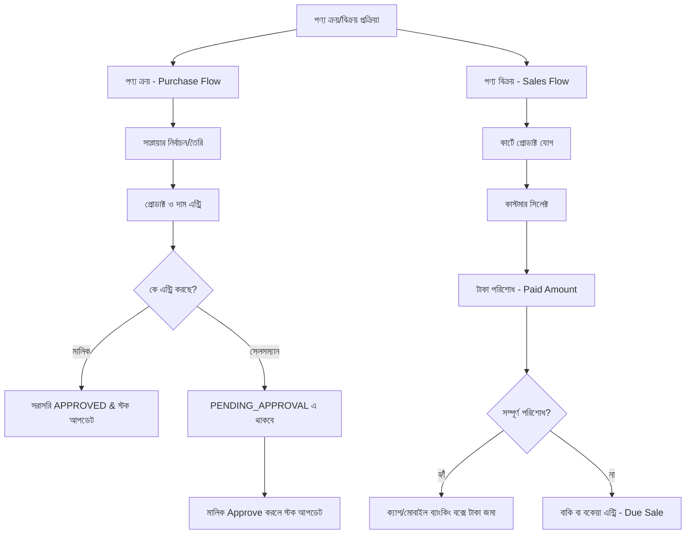

# Dokan ERP (দোকান ইআরপি) - ভূমিকা, ফিচার ও ব্যবহার নির্দেশিকা

এই ডকুমেন্টেশনে Dokan ERP সিস্টেমের বিভিন্ন রোল (এডমিন/মালিক ও সেলসম্যান), পণ্য ক্রয়-বিক্রয় প্রক্রিয়া, বাকিতে বিক্রয় ও বকেয়া সংগ্রহ এবং সেলসম্যানের পারমিশন সংক্রান্ত বিস্তারিত আলোচনা করা হয়েছে।

---

## ১. ব্যবহারকারীর রোলসমূহ (Roles & Responsibilities)

Dokan ERP সিস্টেমে মূলত তিনটি রোল রয়েছে: **প্ল্যাটফর্ম এডমিন (Platform Admin)**, **দোকানের মালিক বা এডমিন (Shop Owner / Admin)**, এবং **সেলসম্যান বা কর্মচারী (Salesman)**।

### ক. দোকানের মালিক / এডমিন (Shop Owner / Admin)
দোকানের মালিকের কাছে সম্পূর্ণ সিস্টেমের পূর্ণ নিয়ন্ত্রণ (Full Control) থাকে।
* **দোকানের সেটিংস ও কনফিগারেশন:** দোকানের নাম, লোগো, ঠিকানা, রসিদের ভিজিবিলিটি সেটিংস, ভাষা, থিম ও কারেন্সি পরিবর্তন।
* **ইনভেন্টরি সেটিংস:** ন্যূনতম স্টক এলার্ট (Low Stock Alert), নেগেটিভ স্টক পারমিশন (Allow Negative Stock), এবং স্টক হিসাবের মেথড (যেমন: FIFO) নির্ধারণ।
* **ট্যাক্স ও চার্জ:** ভ্যাট (VAT) এবং ডেলিভারি চার্জ যোগ বা নিষ্ক্রিয় করা।
* **স্টাফ (সেলসম্যান) ম্যানেজমেন্ট:** নতুন সেলসম্যান যুক্ত করা, তাদের আইডি/পিন নিষ্ক্রিয় বা সক্রিয় করা, সিকিউরিটি পিন রিসেট করা এবং তাদের নির্দিষ্ট পারমিশন পরিবর্তন করা।
* **ক্রয় (Purchase) অনুমোদন:** সেলসম্যান কোনো পণ্যের ক্রয় রিকোয়েস্ট পাঠালে তা যাচাই করে অনুমোদন (Approve) বা বাতিল (Reject) করা।
* **রিপোর্ট ও ক্লোজিং:** দোকানের লাভ-ক্ষতি, দৈনিক/মাসিক বিক্রয় রিপোর্ট, ইনভেন্টরি স্টক ভ্যালুয়েশন রিপোর্ট এবং দিনের শেষে ডেইলি ক্লোজিং (Daily Closing) সামারি দেখা।
* **সাবস্ক্রিপশন:** দোকানের সাবস্ক্রিপশন ও বিলিং পেমেন্ট সম্পন্ন করা।

### খ. সেলসম্যান / কর্মচারী (Salesman)
সেলসম্যানের কার্যক্রম মূলত দোকানের মালিকের দেওয়া পারমিশন বা সুইচের ওপর নির্ভর করে।
* **স্বয়ংক্রিয় সুযোগ:** নিজের প্রোফাইল দেখতে পারা, সাপ্তাহিক/দৈনিক নিজস্ব পারফরম্যান্স চার্ট ও টার্গেট ট্র্যাক করা।
* **নিয়ন্ত্রিত সুযোগ (মালিকের পারমিশন সাপেক্ষে):** পণ্য বিক্রয় করা, দাম পরিবর্তন করা, বকেয়া সংগ্রহ করা, স্টক দেখা এবং রিপোর্ট দেখা।
* **ক্রয় প্রক্রিয়া:** সেলসম্যান কোনো পণ্য ক্রয় সাবমিট করলে তা সরাসরি স্টকে যোগ হয় না; এটি `PENDING_APPROVAL` হিসেবে জমা থাকে। মালিক অনুমোদন দিলে তবেই তা কার্যকর হয়।

### গ. প্ল্যাটফর্ম এডমিন (Platform Admin)
* এটি সিস্টেমের মূল এডমিন প্যানেল।
* দোকানদাররা যখন নতুন কোনো পণ্য বিক্রির জন্য তৈরি করে (Shop Local Product), তখন প্ল্যাটফর্ম এডমিন সেটি যাচাই করে গ্লোবাল ডাটাবেজে (`master_products`) যুক্ত বা রিজেক্ট করতে পারেন।

---

## ২. পণ্য ক্রয় ও বিক্রয় প্রক্রিয়া (Product Buy & Sell Process)

### ক. পণ্য ক্রয় প্রক্রিয়া (Product Purchase Flow)
১. **সাপ্লায়ার সিলেকশন:** প্রথমে সাপ্লায়ার লিস্ট (`GET /app/api/suppliers`) থেকে সাপ্লায়ার সিলেক্ট করা হয়। নতুন সাপ্লায়ার হলে তা যোগ করা হয়।
২. **পণ্য ও পরিমাণ নির্ধারণ:** গ্লোবাল বা লোকাল প্রোডাক্ট থেকে পণ্য নির্বাচন করে পরিমাণ (Quantity) ও ক্রয়মূল্য (Purchase Price) দেওয়া হয়।
৩. **পেমেন্ট ও সাবমিট:** কত টাকা পরিশোধ করা হলো তা লিখে ক্রয় সাবমিট করা হয়।
   * **মালিক ক্রয় করলে:** সরাসরি `APPROVED` হয়ে যায়। সঙ্গে সঙ্গে প্রোডাক্টের ইনভেন্টরি স্টক বৃদ্ধি পায় এবং সাপ্লায়ার লেজারে (Supplier Ledger) ডেবিট-ক্রেডিট এন্ট্রি বসে যায়।
   * **সেলসম্যান ক্রয় করলে:** ট্রানজেকশনটি `PENDING_APPROVAL` স্ট্যাটাসে থাকে। স্টক বা সাপ্লায়ার লেজারে কোনো পরিবর্তন আসে না যতক্ষণ না মালিক তা অনুমোদন করেন।

### খ. পণ্য বিক্রয় প্রক্রিয়া (Product Sales Flow)
১. **কার্ট তৈরি:** কাস্টমার যে পণ্যগুলো কিনবেন তা বারকোড স্ক্যানার বা সার্চের মাধ্যমে কার্টে যুক্ত করা হয়।
২. **কাস্টমার নির্বাচন:** কাস্টমার তালিকা থেকে কাস্টমার সিলেক্ট করা হয় বা নতুন কাস্টমার এন্ট্রি দেওয়া হয়।
৩. **মূল্য পরিশোধ:** কাস্টমার কত টাকা দিচ্ছেন (`paidAmount`) এবং কোন মাধ্যমে দিচ্ছেন (Cash, bKash, Nagad, Card) তা নির্বাচন করা হয়। কাস্টমারের জমানো টাকা থাকলে তা `storeCreditUsed` হিসেবে ব্যবহার করা যায়।
৪. **চেকআউট:** বিক্রয় সম্পন্ন হলে ইনভেন্টরি থেকে পণ্যের স্টক হ্রাস পায় এবং দোকানের ক্যাশ বা মোবাইল ব্যাংকিং বক্সের ব্যালেন্স আপডেট হয়।

---

## ৩. বাকিতে বিক্রয় ও বকেয়া সংগ্রহ (Credit Sales & Due Collection)

### ক. বাকিতে বিক্রয় প্রক্রিয়া (Selling Products on Credit / Baki)
যখন কোনো পণ্যের মোট বিক্রয় মূল্য থেকে কাস্টমার কম টাকা পরিশোধ করেন, তখন বাকি অংশটি বকেয়া বা বাকি হিসেবে কাস্টমারের অ্যাকাউন্টে যোগ হয়।
* **হিসাব সূত্র:**
  $$\text{Due Amount} = \text{Total Invoice Amount} - \text{Paid Amount} - \text{Store Credit Used}$$
* **ডাটাবেজ ও লেজার রেকর্ড:**
  * কাস্টমার লেজারে একটি `SALE` (Debit) এন্ট্রি তৈরি হয়, যা কাস্টমারের মোট দেনা বৃদ্ধি করে।
  * যদি কিছু টাকা নগদ দেওয়া হয়, তবে একটি `PAYMENT` (Credit) এন্ট্রি তৈরি হয়ে দেনা থেকে তা বিয়োগ হয়।
* **ক্রেডিট লিমিট (Credit Limit):** কাস্টমার প্রোফাইলে ক্রেডিট লিমিট (যেমন: `[CreditLimit: 15000]`) সেট করা থাকলে, তার বেশি বাকিতে পণ্য বিক্রয় করা যাবে না।

### খ. বকেয়া সংগ্রহ প্রক্রিয়া (Due Collection Flow)
কাস্টমারের পূর্বের বকেয়া টাকা আদায় করার জন্য নিচের ধাপগুলো অনুসরণ করা হয়:
১. কাস্টমার প্রোফাইল থেকে "Due Collection" বা বকেয়া আদায় অপশনে যেতে হবে।
২. আদায়কৃত টাকার পরিমাণ (Amount) এবং পেমেন্ট মেথড (যেমন: Cash, CARD, bKash, Nagad) সিলেক্ট করতে হবে।
   * **পেমেন্ট মেথড ভ্যালিডেশন:**
     * `BKASH` বা `NAGAD` হলে: সেন্ডার নম্বর (Sender Number) এবং ট্রানজেকশন আইডি (Transaction ID) দিতে হবে।
     * `CARD` হলে: কার্ড হোল্ডার নেম, কার্ডের শেষ ৪ ডিজিট, কার্ড টাইপ এবং ট্রানজেকশন আইডি দিতে হবে।
     * `CASH` হলে কোনো অতিরিক্ত তথ্য লাগবে না।
৩. **ভ্যালিডেশন নিয়ম:** আদায়কৃত টাকার পরিমাণ কাস্টমারের বর্তমান মোট বকেয়া টাকার বেশি হতে পারবে না।
৪. সাবমিট করার পর কাস্টমার লেজারে একটি `PAYMENT` (Credit) এন্ট্রি যোগ হবে, যা কাস্টমারের বকেয়া কমিয়ে দেবে এবং দোকানের ক্যাশ বক্সে টাকা যোগ হবে।

---

## ৪. সেলসম্যান পারমিশন কন্ট্রোল (Salesman Permissions)

দোকানের মালিক যেকোনো সেলসম্যানের প্রোফাইলে গিয়ে নির্দিষ্ট ফিচার অন বা অফ করতে পারেন। নিচে পারমিশনগুলোর তালিকা দেওয়া হলো:

| পারমিশনের নাম (API Field) | বিবরণ (Description) | অন থাকলে (Enabled) | অফ থাকলে (Disabled) |
| :--- | :--- | :--- | :--- |
| **পণ্য বিক্রয়** (`canSell`) | কাস্টমারের কাছে পণ্য বিক্রি করার ক্ষমতা। | কাস্টমার চেকআউট করতে পারবে। | বিক্রয় বা চেকআউট করতে পারবে না। |
| **স্টক দেখা** (`canViewStock`) | দোকানের পণ্যের বর্তমান স্টক দেখার ক্ষমতা। | ইনভেন্টরি ও পণ্যের সংখ্যা দেখতে পারবে। | পণ্যের স্টক দেখতে পারবে না। |
| **রিপোর্ট দেখা** (`canViewReports`) | দোকানের লাভ-ক্ষতি ও বিক্রয় রিপোর্ট দেখার ক্ষমতা। | দৈনিক/মাসিক মোট লাভ-ক্ষতি ও বিক্রয় চার্ট দেখতে পারবে। | কোনো রিপোর্ট বা চার্ট দেখতে পারবে না। |
| **দাম পরিবর্তন** (`canChangePrice`) | বিক্রয় করার সময় পণ্যের নির্ধারিত দাম কমানো বা বাড়ানোর ক্ষমতা। | কার্টে থাকা পণ্যের দাম ম্যানুয়ালি পরিবর্তন করতে পারবে। | পণ্যের নির্ধারিত ফিক্সড দামেই বিক্রি করতে হবে। |
| **বকেয়া সংগ্রহ** (`canCollectDue`) | কাস্টমারের কাছ থেকে বকেয়া টাকা আদায়ের ক্ষমতা। | কাস্টমারের প্রোফাইল থেকে বকেয়া সংগ্রহ ও পেমেন্ট এন্ট্রি করতে পারবে। | বকেয়া টাকা সংগ্রহ বা পেমেন্ট এন্ট্রি করতে পারবে না। |

---
*নোট: যেকোনো সেলসম্যানের পিন কোড ভুলে গেলে দোকানের মালিক তার পিন রিসেট করতে পারবেন, যার ফলে সেলসম্যান পরবর্তী লগইনে নতুন পিন সেট করতে বাধ্য থাকবে।*
